<!-- _class: title -->
<!-- _paginate: false -->

# SSC Project Overview

## 2026.07.21

---

# Format

For each project we have two slides

- one slide with a fixed format for every project
- another slide with anything the presenter wants to present

Then questions / comments / discussion.

---

<!-- _class: subtitle -->

# Current SSC Projects

---

# SEVN

- *Project type:* Open Call
- *Description:* Astrophysics simulation code for binary stars
- *Developer time:* 4 PM
- *People:* Liam
- *Techstack:* C++ / Python / wasm
- *Topic:* Performance Engineering

---

# SEVN Performance Engineering

---

# body-eye-sync

- *Project type:* Open Call
- *Description:* GUI to synchronise video and audio inputs and track mutual gaze of participants
- *Developer time:* 4 PM
- *People:* Tuyen, James, Liam
- *Techstack:* Python
- *Topic:* Feature development

---

# body-eye-sync object tracking

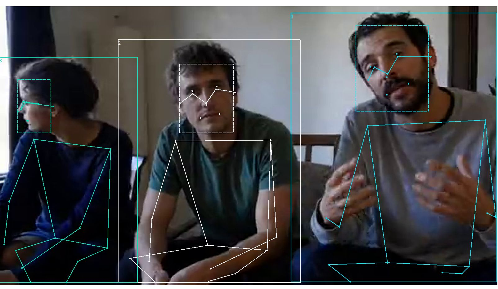

---

# SENTINEL-RAT (aka. Smart-Rodent)

- *Project type:* Funded
- *Description:* Rodent and predator (peacock / snake) detection from RGB and thermal cameras for leptospirosis risk in Sri Lanka
- *Developer time:* 4 PM / 1 year / etc
- *People:* Inga, Harald, James, Tuyen
- *Techstack:* R / Python / ML (YOLO26) / DB (TBD.)
- *Topic:* Feature development

---

# SENTINEL-RAT Architecture
- Task: Build camera-trap based surveilance system to detect rodent/snake/bird species based on rgb camera images (and possibly thermal images)
- ML Models: YOLO26-detect (ultralytics), Speciesnet (Google), thermal image integration?
- Difficulties: No rodent datasets for this use case, citizen scientists dataset highly biased wrt species

  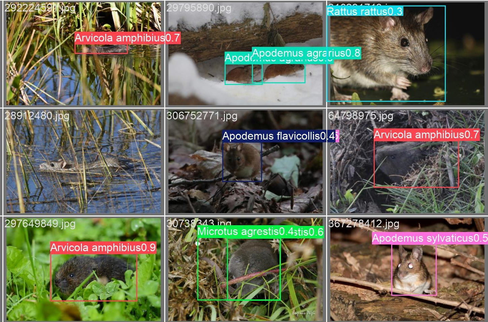
  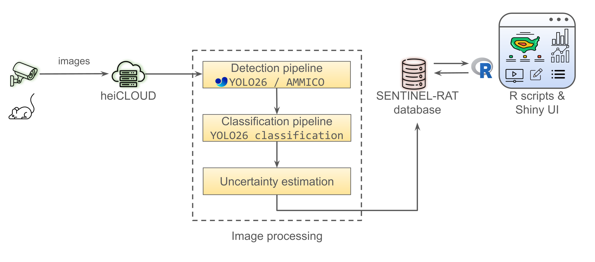

---

# Bio-Structure Hub

- *Project type:* Externally Funded (KTS)
- *Description:* Establish a hub for structure prediction of biomolecules
- *Developer time:* 15/36 months
- *People:* Christine, Inga, Johannes, Rebecca Wade (HITS)
- *Techstack:* Python
- *Topic:* HPC infrastructure access, consultation, training

---

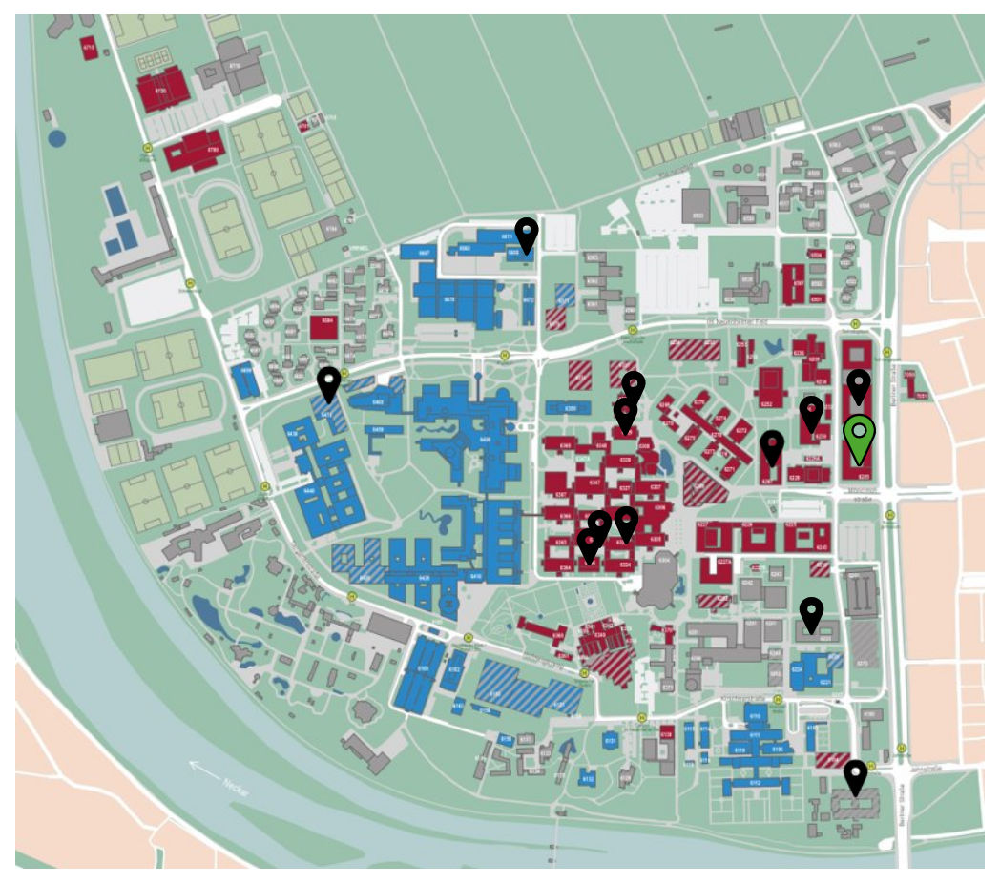

- over 20 requests / projects
- new tutorials / notebooks:
    - antibody / protein generation
    - molecular dynamics
    - protein-protein interaction
    - bwVisu to Helix transition
    - AlphaFold mapping

- MCB course, HD-MA symposium, science slam, ELIXIR TTT

---
# bwRSE4HPC

- *Project type:* Collaboration with KIT
- *Description:* RSE support for HPC projects in academic institutions in Baden-Württemberg
- *People:* Kai (RSE 50%), Thomas (RSE 100%, soon maybe 50%), Dimitrii (RSE, ?), Tommaso (RSE, ?), Dominic (Lead) Inga (Lead backup) + KIT: Glen, Tim, Marcel, Jasmin + others
- *Topic:* Any
---

# bwRSE4HPC: Finished projects
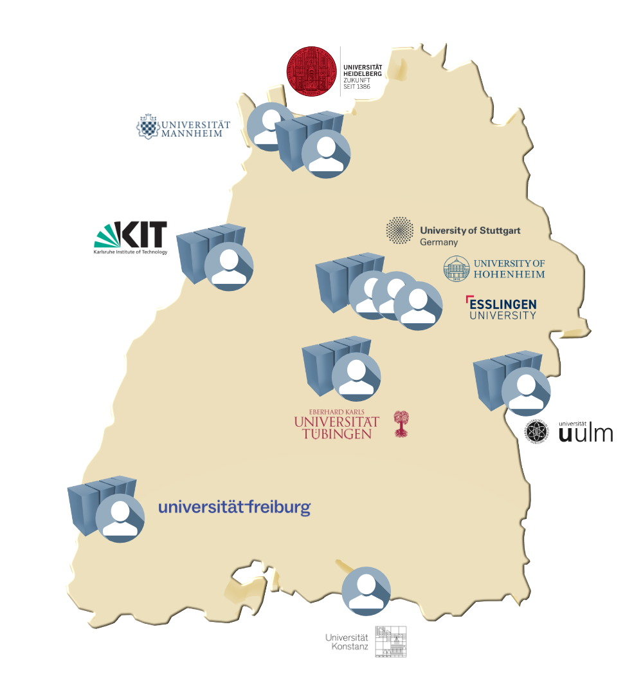

- **Kimmdy** (Kai): Kinematic Monte Carlo code, developed for molecular dynamic
- **genomicrelatedness** (Thomas): Nextflow pipeline for extracting genomic relatedness from genetic samples
- **M++/Ginkgo** (Tim, Marcel): Integrating linear algebra library in existing FE solver
- **Organelle morphology** (Kai, Tim): Analyze volumetric electron microscopy images, in particular, images of cells.
- **eCoSim** (Glen): Co-simulation of power grids at scales from single houses to whole cities
- **Some others** (KIT)

---
# ndtbl

- *Project type:* bwRSE4HPC
- *Description:* Fast and memory-efficient lookup in high-dimensional tables
- *Developer time:* 3 PM
- *People:* Thomas
- *Techstack:* C++ / Python
- *Topic:* Feature development

---
# ndtbl: shared-memory

  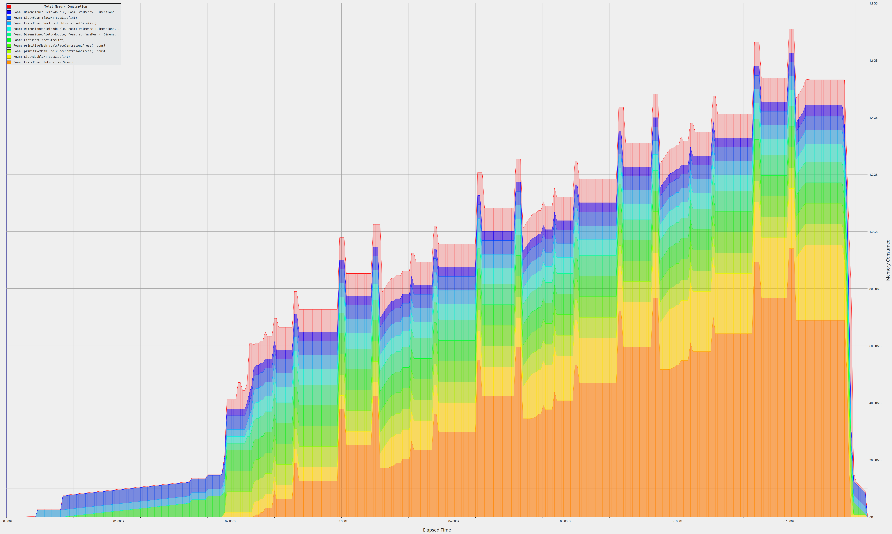
  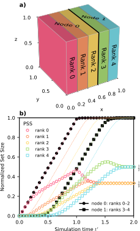
  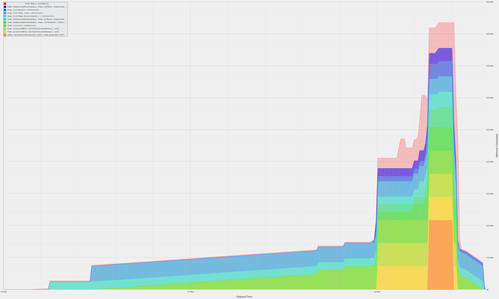

---

# Turbine Design System

- *Project type:* bwRSE4HPC
- *Description:* Provide a reusable Python orchestration layer for their workflows
- *Developer time:* 1.5 PM
- *People:* Thomas
- *Techstack:* Python (some C++)
- *Topic:* Python packaging, best practices, reproducibility

---

# Turbine Design System
Left: not optimized, Right: optimized
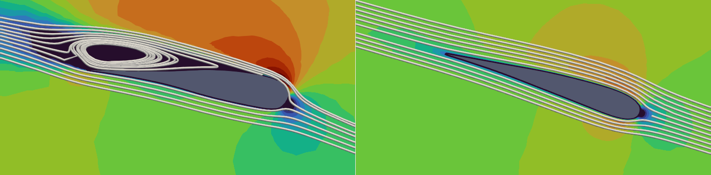

- Optimization of blade geometry (or any geometry submerged in a flow)
- Island model: launch many candidiates, each with a CFD simulation, exchange information
- Python "code" uses bindings to dtOO, an old-school C++ code
- No reproducible installation (copy paste code), no dependency management, no package

---

# py4dgeo

- *Project type:* Open Call 2021/22, now externally funded
- *Description:* Change analysis of three-dimensional point cloud time series
- *Developer time:* 2 PM / year + extras
- *People:* Dominic, Dimitrii, Thomas + former members Petr, Alex
- *Techstack:* Python / C++ (pybind11)
- *Topic:* Feature development, maintenance

---

# py4dgeo: Change Analysis
- Laser scanning (Lidar) used to acquire point clouds of scenes
- Automated analysis and change quantification of time series of point clouds
- Quantitatively understanding geomorphological processes
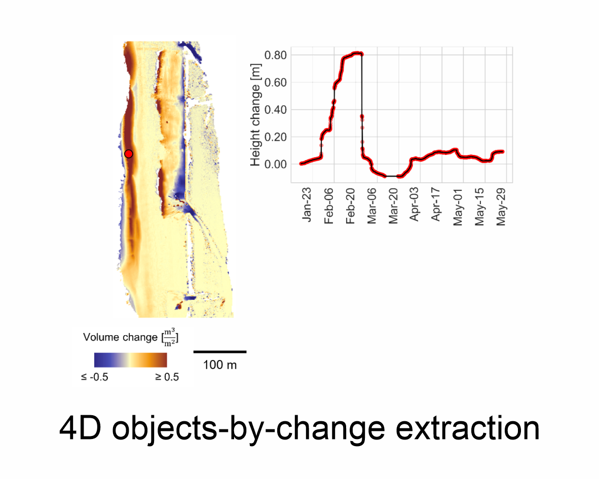

---

# PanSeg (formerly PlantSeg)

- *Project type:* Externally funded
- *Description:* Segmentation of plant images into cells
- *Developer time:* 50% of Kai
- *People:* Kai
- *Techstack:* Python, PyTorch ML models, Napari GUI, Dask
- *Topic:* Feature development, maintenance

---

# PanSeg
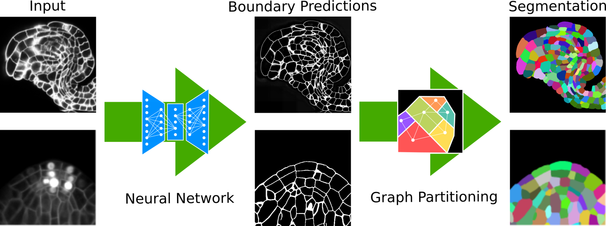

---

# ACID

- *Project type:* Open Call, former small scale
- *Description:* Microscopy image analysis pipeline
- *Developer time:* 2 PM +
- *People:* Christine, Edwin, Kai, Tomáš (CZ)
- *Techstack:* Python / Jupyter Notebooks
- *Topic:* Python packaging, best practices, reproducibility

---

# ACID
current status:
- pipeline as a series of Jupyter notebooks
- python modules exists
- no testing
- limited documentation

goals:
- introduce testing on pipeline level
- clean up notebooks and modules
- one notebook as minimal documentation
- run notebook / package on HPC

---

# BioCypher

- *Project type:* Funded
- *Description:* Build knowledge graphs from unstructured and inhomogeneous omics data
- *Developer time:* ~25 (22) + 12 (6) PM
- *People:* Edwin, James, Inga
- *Techstack:* Python / React / MCP
- *Topic:* Research Software Infrastucture for different domains

---

# BioCypher components registry

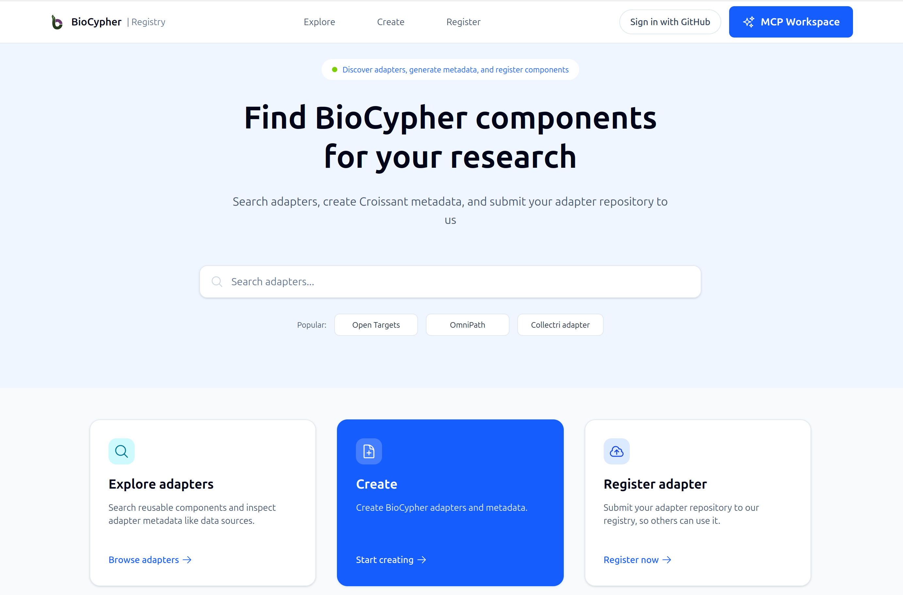

- BioCypher adapter: A piece of code + configuration files + schema + ontology that makes your data ingestable for BioCypher, to turn it into a knowledge graph
- Registry:
  - Register existing adapters and allow re-use
  - Croissant + BioSchema metadata for data + adapter
  - Make it easier for users to build their own adapter: Agentic Workspace (MCP + Chat + File Editor)

---

<!--
_backgroundImage: 'url("biocypher2.png")'
_backgroundSize: contain
_backgroundPosition: center bottom 5%
-->

---

# TRAIN

- *Project type:* Open Call
- *Description:* Make it easier for researchers and students to use the TRAIN hydrological model (written in Fortran), prepare model for publication
- *Developer time:* ~2 (0) PM
- *People:* Inga
- *Techstack:* Fortran / Python / `magicgui`
- *Topic:* Usability, refactoring, best practices

---

# TRAIN purpose and interface

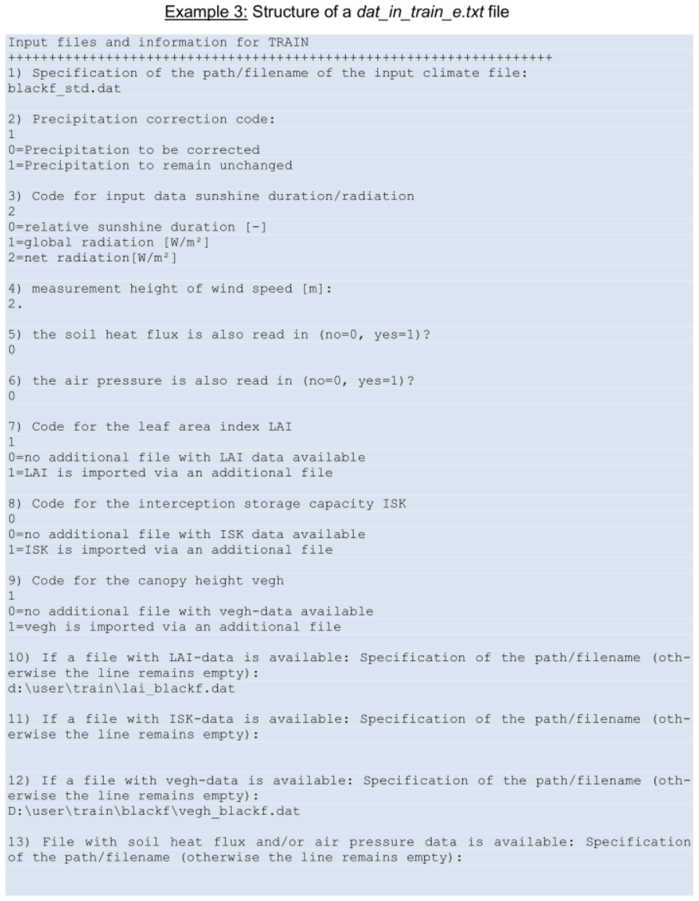

- Model can run with minimal metereological data, but if more data is available (ie. land use, more precise measurements) it can be used in the modelling, which is rooted in the modular design of the model
- Addition of new input parameters cumbersome in Fortran, both for the model and the interface
- Model shall be published open-source

---

# heiplanet-platform

- *Project type:* Funded
- *Description:* Web interface to show climate-health model predictions for models developed in the Rockloev group
- *Developer time:* ~6 (6) PM
- *People:* Tuyen, Harald, Edwin, James, Inga
- *Techstack:* Python / React / FastAPI / postgres
- *Topic:* Refactoring, Research Software Infrastructure, Usability, Stakeholder Engagement

---

# heiplanet-platform

  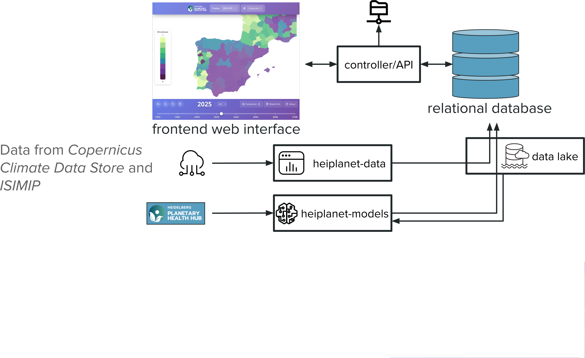
  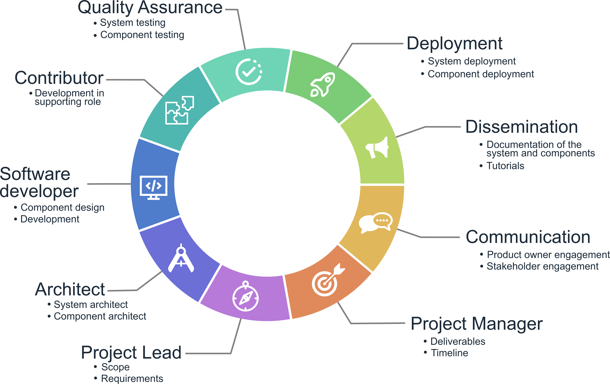

---

# papyri-assistant

- *Project type:* Open Call
- *Description:* RAG system for digital papyrology
- *Developer time:* 4 PM
- *People:*
  - SSC: Dominic, Harald, Sara (Prague)
  - Papyrology: Holger Essler, James Cowey, Carmen Lanz
- *Techstack:* Python / Web / PostGres / langchain
- *Topic:* Retrieval Augemented Generation

---

# papyri-assistant

  
  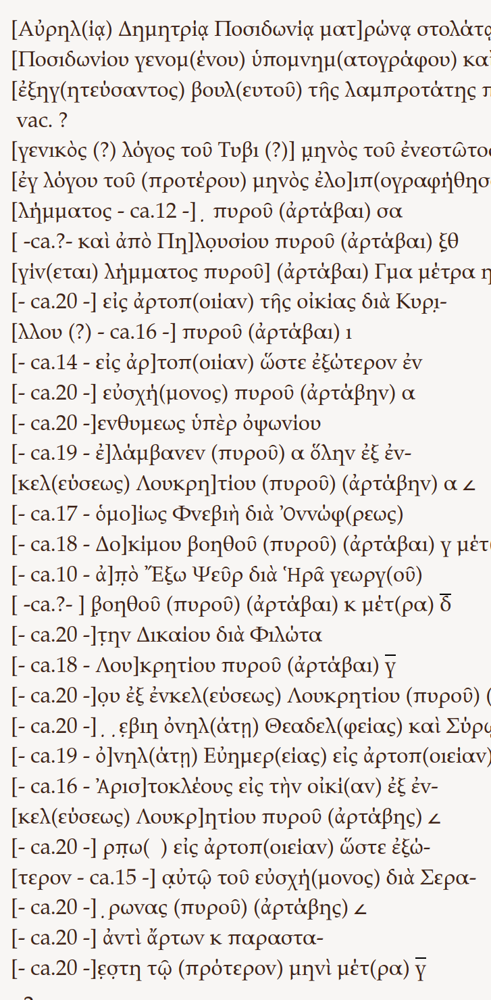

---

# CORSES

- *Project type:* Funded by DFG
- *Description:* Nation-wide RSE Support
- *Developer time:* 30 PM
- *People:*
  - SSC PI: Dominic
  - Other PIs: Jan Linxweiler, Robert Speck, Mustafa Dogan
  - potentially all SSC RSES
- *Techstack:* all of them

---

# CORSES

- Make SSC-like services available to researchers from all Germany
- Pool expertise from multiple existing teams
- We do lead this RSE Pool
- Exact services t.b.d. but most likely
  - Consultation
  - Small Scale or extended small scale projects
- Could be a very interesting source of projects

---

# project-W

- *Project type:* Small scale/Hiwi Project
- *Description:* On premise audio transcription platform
- *Developer time:* 18 HM (Hiwi months)
- *People:* Julian, Dominic
- *Techstack:* Python, Svelte, Postgres

---

# project-W

- Quite mature platform
- Currently hosted by URZ
- Future unclear

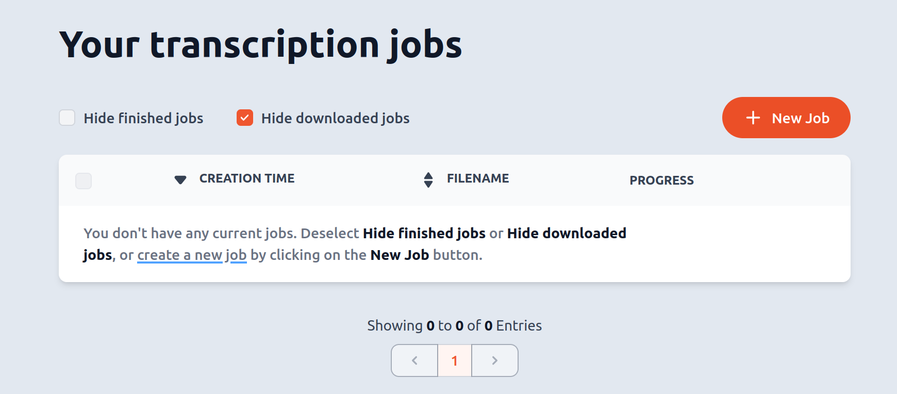

---

# ECPO (Early Chinese Periodicals Online)

- *Project type:* Open Call (2025)
- *Description:* An open-source AI pipeline for layout segmentation and OCR of Early Chinese Periodicals
- *Developer time:* 5 PM
- *People:* Dominic, Tuyen, Harald
- *Techstack:* Python / C++ / VLMs

---

# Current pipeline and potential follow-ups
- Current pipeline:
`IMGs` $\rightarrow$ `Layout seg. with Eynollah` $\rightarrow$ `Seg. refinement with PaddleOCR` $\rightarrow$ `OCR with VLM`

  
  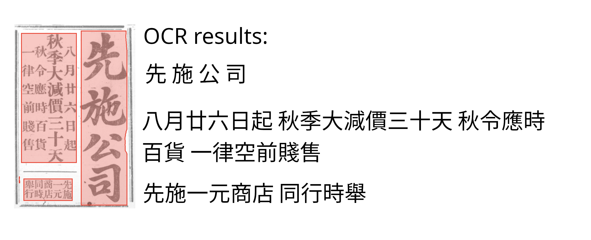

- Potential follow-ups: a DFG-funded project and collaboration with the Staatsbibliothek zu Berlin (SBB)
---

# Galaxy-Spectrum-Classification (a.k.a. Zinchenko) project

- *Project type:* Open Call (2026)
- *Description:* An open-source machine learning system for classifying the energy source for the ionization of gas in far-away galaxies
- *Developer time:* 1 PM
- *People:*  Harald
- *Techstack:* Python, scikit-learn, pytorch
- *Topic:* Feature development

---

# Galaxy-Spectrum-Classification (a.k.a. Zinchenko) project
- Goal: Build and evaluate ML model for classifying  classifying the energy source for the ionization of gas in far-away galaxies, plus uncertainty quantification and evaluation.
- Problem has been explored, but not for the parameter region we are interested in

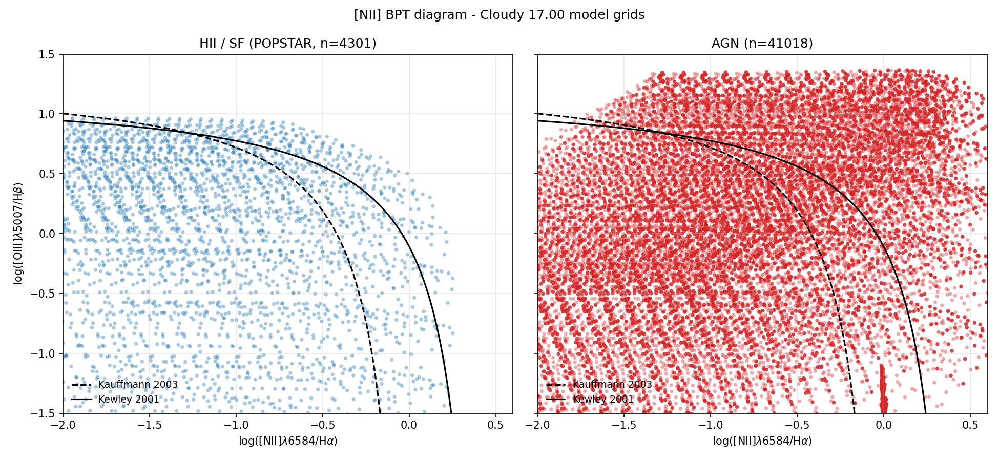

---

# COSMOS

- *Project type:* Funded
- *Description:* Optimization and refactoring of pipeline for astrophysical data analysis
- *Developer time:* 3 year
- *People:* Yiꝗing / Tommaso
- *Techstack:* Python / JAX / numba
- *Topic:* Performance engineering

---

# COSMOS

Currently working on **fuzzycat** (auth: William H. Oliver), an algorithm for fuzzy clusters detection
from series of clusterings on point-based data:
- optimizing existing routines through kernels simplification (for better JIT), and reduced memory allocations;
- use of approximated algorithm for Jaccard indexes calculation (PyNNDescent library).

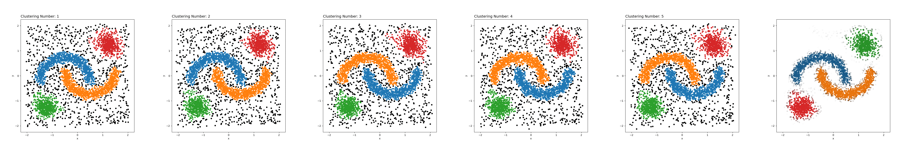

*[images taken from fuzzycat official documentation at https://fuzzycat.readthedocs.io/en/latest/intro.html]*

---

# MONDEY

- *Project type:* Funded (2024 open call follow-up)
- *Description:* Minor modifications to the mondey.de web service
- *Developer time:* 1 PM
- *People:* James / Liam
- *Techstack:* Typescript (svelte) / Python (fastapi) / Postgres / Docker
- *Topic:* Feature development

---

# MONDEY

Updating feedback algorithms and other small features on [mondey.de](https://mondey.de), before the website is used in a study starting in August involving multiple kindergartens and thousands of children.

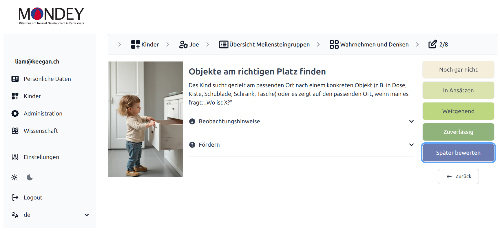

---

# Helios++

- *Project type:* Externally Funded (2024-2027)
- *Description:* A  package for simulation of terrestrial, mobile and airborne laser scanning surveys
- *Developer time:* 6 PM / year for 3 years
- *People:* Dominic, Thomas, Dmitrii
- *Techstack:* Python / C++ / pybind11
- *Topic:* System Architecture / API Design, Feature development

---

# Helios++

Overall, we've implemented most of the intended functionality (and added a lot more on top of that).
There are still a few tasks left to tackle before the release.

