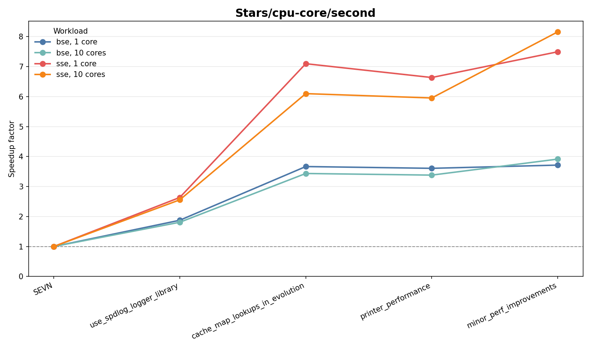

<!-- _class: title -->
<!-- _paginate: false -->

# SSC Project Overview

## 2026.07.21

---

# Format

For each project we have two slides

- one slide with a fixed format for every project
- another slide with anything the presenter wants to present

Then questions / comments / discussion.

---

# SEVN

- *Project type:* Open Call
- *Description:* Astrophysics simulation code for binary stars
- *Developer time:* 4 PM
- *People:* Liam
- *Techstack:* C++ / Python / wasm
- *Topic:* Performance Engineering

---

# SEVN Performance Engineering

